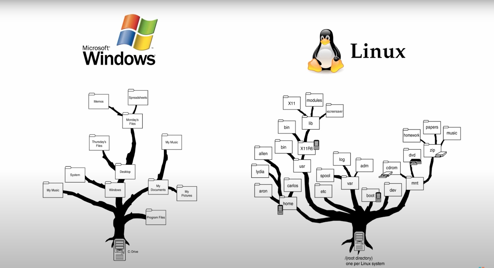

В Linux файлами считаются абсолютно всё:

1. Жесткие диски

2. Разделы на жестких дисках

3. Съемные носители информации

4. Приводы оптических дисков

5. директории (каталоги) - содержат списки файлов закрепленных за ними

В Linux нет обозначений у логических дисков, как в Windows (`C:\`, `D:\`, ... - `C:\User\Ivan`)

В Linux один корневой каталог `/` (- `/home/ivan`)

Монтирование - процесс подключения носителя информации к файловой системе

Содержимое флешки: `/media/usb_disk` - новый каталог `usb_disk/` - назвыется точка монтирования

Перед извлечением носителя информации от файловой системы - требуется сделать размонтирование

`sudo` - `S`uper `U`ser `Do` - Выполнить с администраторскими правами

`apt-get` - Advanced Packagin Tool - Расширенное управление пакетами

`sudo apt-get install -y skype wine rar`
`sudo apt-get remove skype wine rar`

`man` - manual - руководство

Эмуляторы терминала - например `terminator` - позволяет открывать 4 терминала в одном окне
