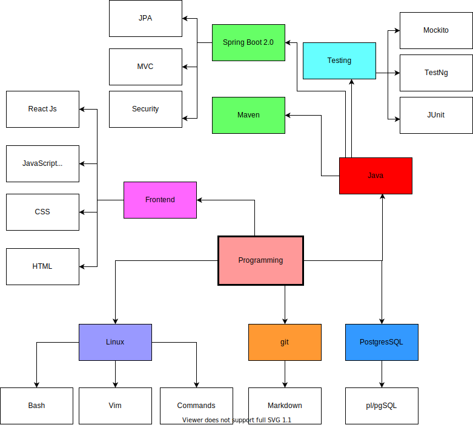

# knowledge_base
База знаний хранит в себе наработки по коду применительно к ситуациям в которых эти наработки будут полезны. Это обеспечивает быстрое решение задачи уже ранее использовавшимся методом. Причем не требуется перелопачивать интернет в поисках лучшего метода под конкретную ситуацию.

