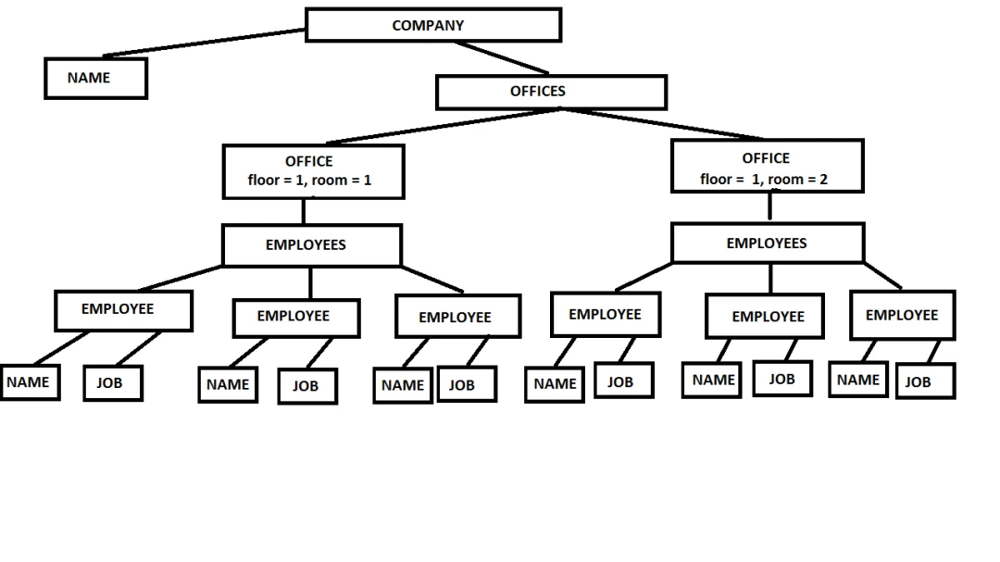

# XML


[JavaRush](https://javarush.ru/groups/posts/620-konkurs-osnovih-xml-dlja-java-programmista---chastjh-1-iz-3)

[XML Tutorial](https://www.w3schools.com/xml/default.asp)

[Книга о XML](https://tdg.docbook.org/tdg/4.5/docbook.html)

## XML

HTML и XML похожи синтаксисом, так как у них общий родитель – SGML. Однако, в HTML есть только фиксированные теги конкретного стандарта, в то время, как в XML вы можете создавать свои собственные теги, атрибуты и, в целом, делать все, что захотите, чтобы хранить данные так, как вам будет удобно.

## xml validation methods

1. DTD (.dtd)
2. XML Schema (.xsd (xml scheme definition))
   
   схемы – очень продвинутый механизм валидации XML документов и значительно более функциональный, чем DTD

   **проверка типов, поддержка нэймспэйсов и более широкий функционал.**

## DTD 

DTD – это технология валидации XML-документов. 
DTD объявляет конкретные правила для типа документа: 
его элементы, какие элементы могут быть внутри элемента, атрибуты, 
обязательные они или нет, количество их повторений, а так же сущности (Entity).

1. Внедрение - написание DTD правил внутри самого XML файла, достаточно просто написать корневой элемент после ключевого слова DOCTYPE и заключить наш DTD файл внутри квадратных скобочек.
2. Импорт - мы записываем все наши правила в отдельный DTD файл, после чего в XML файле используем DOCTYPE-конструкцию из первого способа, только вместо квадратных скобочек нужно написать SYSTEM и указать абсолютный или относительный до текущего местоположения файла путь.



И последняя конструкция – это CDATA, означает «символьные данные».
Благодаря данной конструкции, можно записывать текст, 
который не будет интерпретироваться как разметка XML. 
Это полезно, если внутри XML файла у вас есть сущность,
которая хранит в информации XML разметку. Пример:

```xml
<?xml version="1.0" encoding="UTF-8" ?>
<bean>
    <information>
        <![CDATA[<name>Ivan</name><age>26</age>]]>
    </information>
</bean>
```


### ELEMENT

Служит для описания элемента. Элементы, которые можно использовать 
внутри описанного элемента, перечисляются в скобках в виде списка. 
Можно использовать квантификаторы для указания количества 
(они аналогичны с квантификаторами из регулярных выражений):

Элемент | Значение
--------|--------------------
+       | значит 1+
*       | значит 0+ 
?       | значит 0 ИЛИ 1

Если квантификаторов не было добавлено, то считается,
что должен быть только 1 элемент.